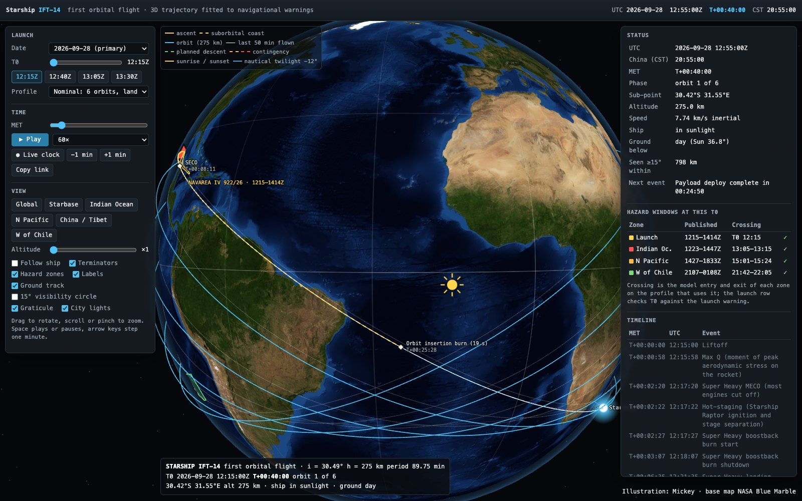

# Starship-IFT14
Starship-IFT14 flight track

Working copy of [exoplanet5/Starship-IFT14](https://github.com/exoplanet5/Starship-IFT14) in `jeffreytanhao-eng/reference-rocket-prediction`.

Trajectory model of **Starship IFT-14**, the first orbital flight, fitted to the published navigational-warning
hazard zones, plus maps, TLEs and an interactive 3D page. Flight 14 flew on 28 Sep 2026 (liftoff 12:48:59 UTC),
returned after two orbits and splashed down north of Hawaii at T+03:08:30; the page includes that flight with a
physical entry reconstruction.



**Interactive page:** open `docs/index.html` through a web server (see below), or GitHub Pages after the first deploy:
`https://jeffreytanhao-eng.github.io/reference-rocket-prediction/`.

Original author site: `https://exoplanet5.github.io/Starship-IFT14/`.

## What is here

| path | content |
|---|---|
| `docs/` | 3D page (three.js, vendored): trajectory, hazard zones, launch-date and T0 shift, MET playback, live clock, major Chinese cities with a pop-up sky chart of Starship passes (also for any typed latitude/longitude), foldable side panels, sunrise/sunset and −12° nautical-twilight terminators, hazard-window check, TLE for any T0 |
| `ift14_navwarning_map.png` | global map: ground track, all hazard zones, insertion burn, contingency deorbit and reentry, planned deorbit burn and landing W of Chile |
| `ift14_china_T0_*.png` | China/Tibet zoom at T0+08:53:00 for T0 12:15, 12:40, 13:05, 13:30Z: burn point, 15° visibility circle and swath, sunrise and nautical-twilight lines |
| `ift14_tles.txt`, `ift14_tles_alternates.txt` | SGP4 TLEs fitted to the model orbit for each T0 (28 Sep, and 29 Sep – 4 Oct) |
| `ift14_summary.md` | fit, timeline, hazard-window analysis, warning verification, TLE notes |
| `navwarning/`, `navwarning_old/` | current and previous NAVAREA / HYDROPAC warnings (KML) |
| `flight-timeline.txt` | official flight timeline used for event times |
| `work/` | Python: fit, maps, TLEs, entry reconstruction, web export |

## Model in one paragraph

A 275 km circular orbit with J2 secular rates is fitted to the centrelines of the launch, Indian Ocean, North
Pacific and South Pacific zones (i = 30.58°, nodal period 89.75 min); the plane passes about 60 km from the pad and
the ascent leaves Starbase and steers into it. SECO at T+00:08:11 leaves the ship on a suborbital ellipse; the 19 s
insertion burn at apogee (T+00:25:28) circularises it. The planned descent from the deorbit burn at T+08:52:18 is
sized to reach entry interface at the official entry time and landing at T+09:50:30. Flight 14's actual entry
(deorbit burn T+02:12:00) is a 3-DOF simulation on a rotating WGS-84 Earth with J2 gravity, the US Standard
Atmosphere 1976 and Newtonian belly-first aerodynamics, solved to hit the reported splashdown point and time
(`work/ift14_entry.py`); the planned and contingency descents use the same model and vehicle (`work/ift14_descents.py`). It is a model built from public warnings and reports, **not official ephemeris**.

## Run the page locally

```sh
cd docs
python3 -m http.server 8000
# open http://localhost:8000
```

URL parameters restore a view, for example `?date=2026-09-28&t0=13:05&met=08:53:00&br=planned&cam=95,28,1.9&fp=1`.
Add `&sky=Chengdu` or `&sky=25.8310,114.9336` to open the sky chart for a city or for coordinates.

## Rebuild the products

Python 3.13 with numpy, scipy, shapely, matplotlib, pillow, sgp4, skyfield. Paths inside `work/` are absolute to
the author's machine, and the maps expect the NASA Blue Marble NG `world.topo.bathy.200409.3x21600x10800.jpg`.

```sh
python work/ift14_fit.py            # fit and timeline report
python work/ift14_map.py            # global map
python work/ift14_china.py          # four China maps
python work/ift14_tle.py            # TLEs
python work/ift14_entry.py --solve --export   # Flight 14 entry reconstruction (a few minutes)
python work/ift14_descents.py --solve          # physical descents for all profiles (a few minutes)
python work/ift14_web_export.py --tex   # docs/data/ift14.json and web textures
```

## Credits

Illustration: Mickey. Base map: NASA Blue Marble Next Generation and Black Marble (public domain).
3D rendering: three.js (MIT, `docs/vendor/three/LICENSE`). Star catalog and Milky Way: d3-celestial (BSD-3, `docs/data/STARDATA-LICENSE.txt`), via the SatObserver-MX sky chart. Code: MIT, see `LICENSE`.
